# File Format Reverse Engineering Writeup

## Overview
Consists of 4 challenge of increasing difficulty. For the first three levels, you'll be provided a file. You will need to examine the file, document the structure and extract out any data. You are highly encouraged to develop scripts to handle each of these levels. The last level will give you the opportunity to create your own file format.

## Things you'll need:
* Hex Editor
* Python
* Cyberchef
* Other online resources

# Level 1

**Task:** Given a file, use pattern analysis to determine the encryption key and decrypt the data.

This was the data given:

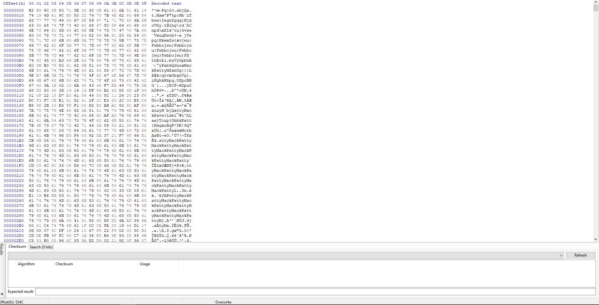

## **What are some patterns to recognize?**

After looking at the file, you can see that the phrase **MackPatty** repeats a lot in the beginning. This is something to look at. 

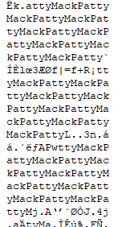

* **What format is the text  in?**

Since many of these characters are not recognizable, it is not in regular ASCII but UTF-8. 

* **What is the length of the file**

The total length of the file is only 24534 bits, which is relatively small. Videos are typically much larger than this, which helps us rule that file format out. 

## **Next Steps**

After analyzing the patterns, it is pretty obvious that the phrase **MackPatty** is the encryption key. Knowing the knowledge, it is time to use CyberChef and try some of the possible decryption methods. Some of the ciphers I tried included Caesar Cipher, Substitution Cipher, and Vigenere Decode just to name a few. 

I then XORed the file, and got the following result:

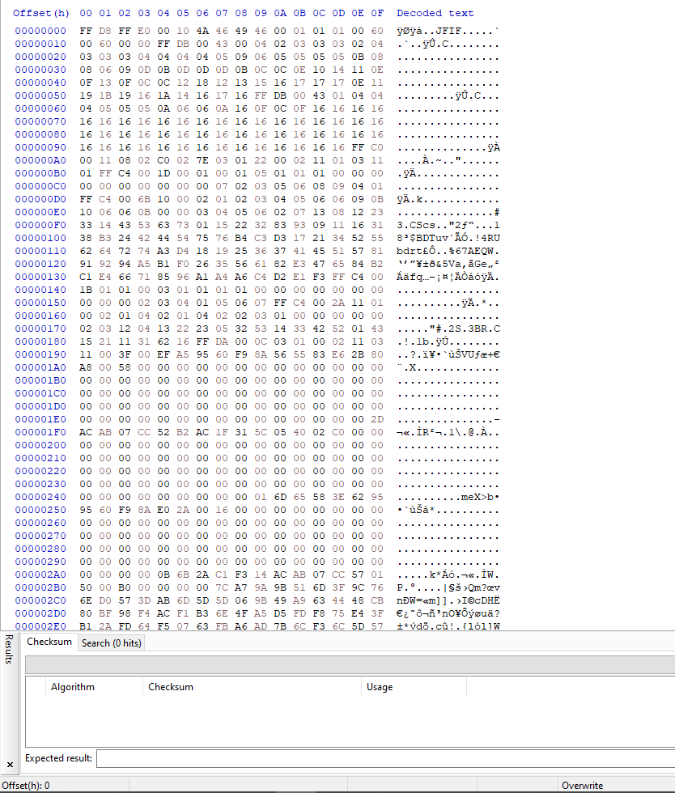

## **Why XOR?**

XOR is a symmetric encryption, meaning that the same key can encode and decode the file. There is another reason why a XOR passphrase repeats a lot in files. Many files have spots where there are just *00* bytes. When those *00* bytes are XORed by a key, those bytes are know the XOR key, which is a big hint to a XOR cipher.

## **Part 2**

The key for this part is to look at the magic bytes, or file signatures. Using online sources, such as [File Signatures](https://www.garykessler.net/library/file_sigs.html), we can see that this file signature correlates to a **jpg** file format.

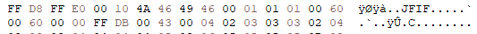

Save it as a **jpg** file and it will result in the following picture:

## **Python Code to Automate XOR Cipher**

Below is a picture of the code to automate the XOR cipher. Link to [code](Level1.py).

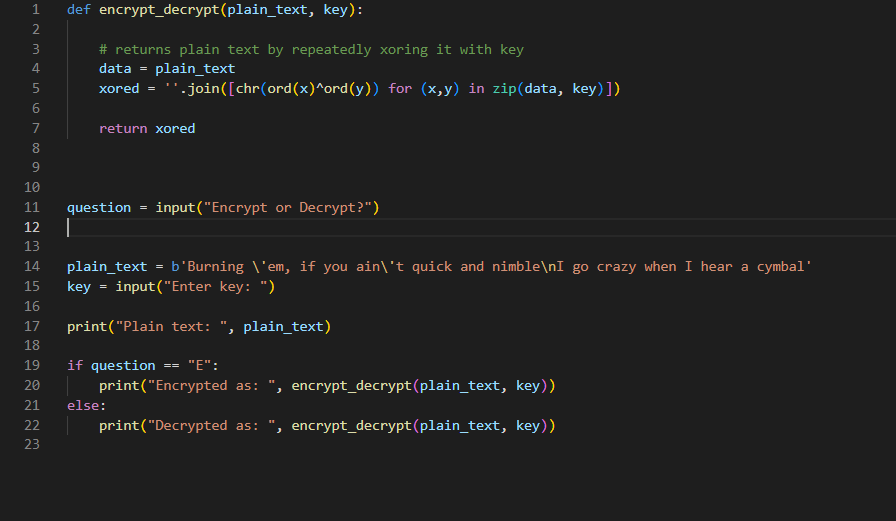

 

# Level 2

**Task:** 
* Examine the data in a hex exitor.
* Look for patterns and document what you find. Also consider how data might be stored. Is it raw? Encoded? Encrypted?
* Write a Python script to decode or decrypt the data. Print your results to screen. 

This was the data given:

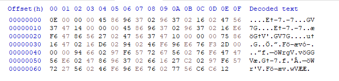

## **What are some patterns?**

After looking at the data, there are some repeating phrases: *-7*, *GV7G*, and *Et*. These could lead to some potential solutions. 

* **What is the length of the file?**

The length of the file is extremely small, narrowing the potential formats significantly. Since videos and pictures are too big, the most probably format is a text file.

* **What is the file signature?**

The file signature *0E 00 00 00* does not represent any file format. This file is definitely encrypted or obfuscated.

## **Next Steps**

Using CyberChef, we test the repeating phrases to see if it is a XOR key. Unfortunately, that doesn't result in any readable text or phrase. 

Notice that there are a lot of *02* bytes. Those bytes reversed is *20*, which is space in ASCII. After recognizing this, reverse the bytes in CyberChef to get the result:

## **CyberChef Recipe**

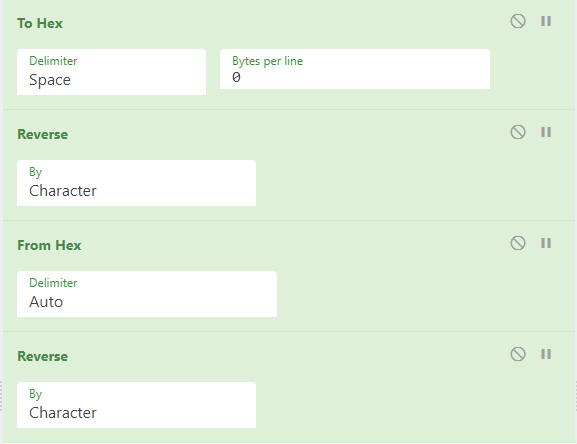

## **Printed Result**

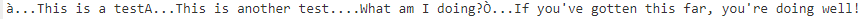

 

# Level 3

**Task:** 
* Examine the data in a hex editor. 
* Look for patterns and document what you find. Also consider how data might be stored. Is it raw? Encoded? Encrypted?
* Write a Python scipt to decode or decrypt the data. Note that this level will require writing recovered files to disk. Your script should accpet an output directory to write these files to.

The following files was given to us:

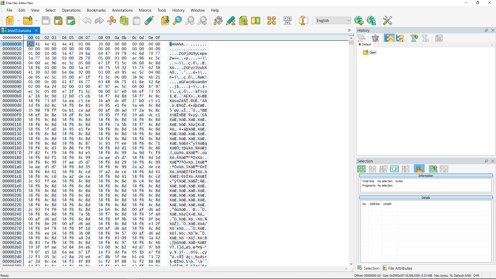

## **What are some patterns?**

One phrase I noticed repeat a lot was *XöŒ*. I also recognized that there were a lot of *00* bytes after the file header, which intrigued me. 

* **What is the length of the file?**

This is an extremely large file, which led me to think that this is a **jpg** or **mp4** file. 

I XORed the file with the *XöŒ* phrase because of how much it appeared in the file. After XORing the file, this was the outcome. 

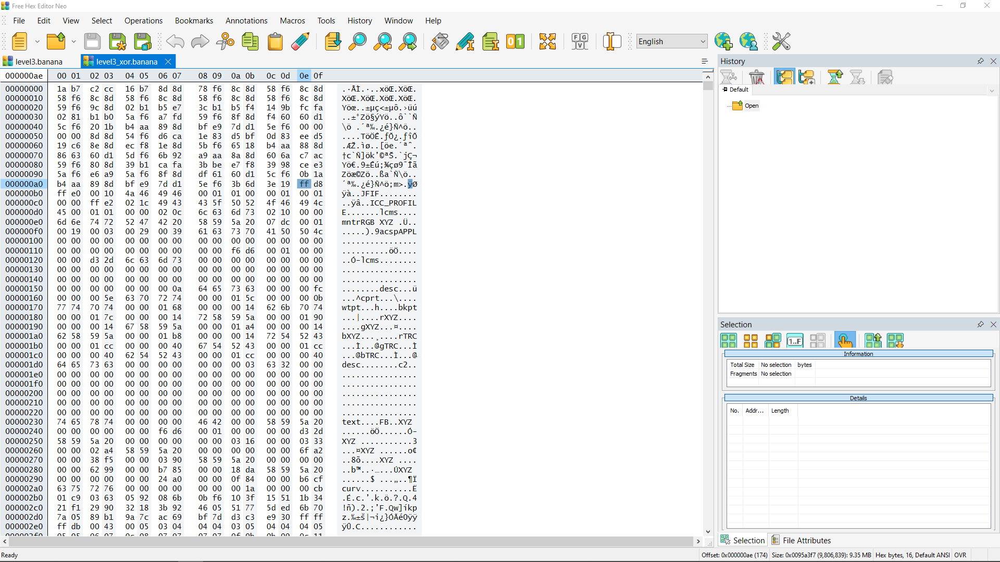

When looking at the file, you can recognize the start of the JPG file (highlighted byte in picture). Referring back to the list of file signatures, JPGs tend to also have a trailer. After finding the trailer, copy that into a separate file and change the file format to a jpg.

The following picture appears: 

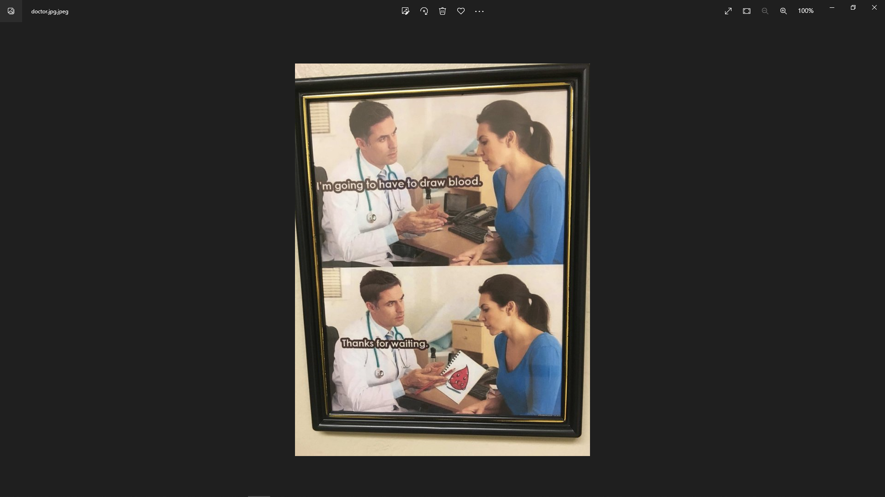
